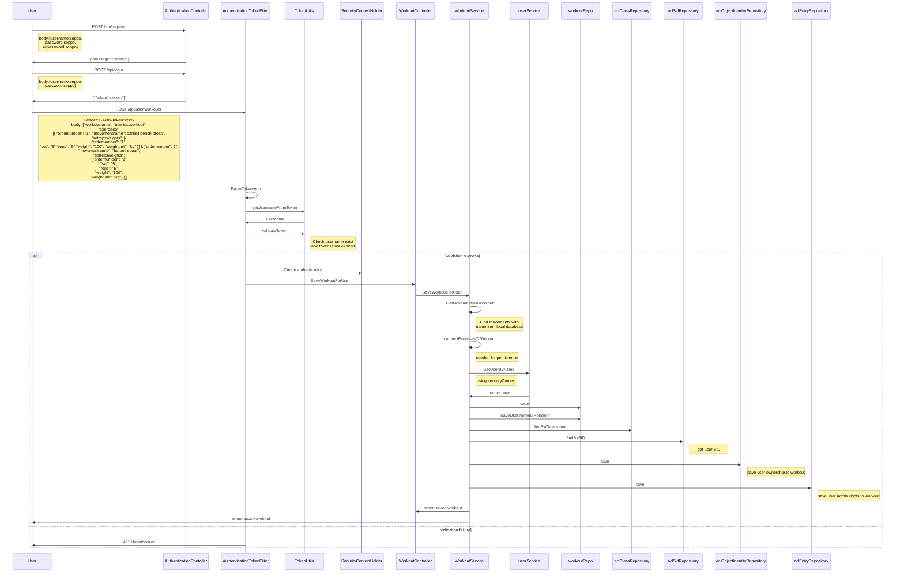

# TRACKTHATBARBELL

## Project main goal:
How to create api secured with Spring Security ACL.
This project is to test spring security acl, so it full of not-so-optimal decisions.

User can login, receive jwt token and use jwt token to add workouts.
Spring security acl makes possible to user(s) to share workouts and this could be used by personal trainers to plan their clients work. (this is yet to be implemented.)

Program load exercises from exercises.txt.

---
## To run:

**Dockerized**:

This is now dockerized so you can just run 

```
docker compose build
docker compose up 
```

in root. 
There is postgresql database included.

**Dev**:

To run locally (dev):
- Install postgres database
- Create empty database to postgres.
- Run code with env variables:
    - database=postgres database name
    - database_password=database user password
    - database_user
    - host=localhost
    - log_level=
    - port=postgres database port, default is 5432
    - server_port=where port this api runs.
- Also in IDE set profile "dev".

You can also overwrite these in application.properties file.

**Using**:

You can test this with postman importing TTB.postman_collection.json file. 
(Before creating workout you need to create user.)

---


## Sequencediagram of user creation, user login and saving workout for user:



---

## Backlog
**Done:**
- [x] Implement swagger
- [x] dockerization.

**In Progress:**
**TODO:**
- Add check to GetMovementsToWorkout error returns if too many or none found
**Logging:**
- Add logging filter.
  	- Logging before database call.
  	- Logging for failed logins with ip.

**Testing:**
- Data used in tests is not removed from database.

**Security:**
- implement peppering to security.

**Filtering:**
- Add filtering to all apis.
	- register
		- password twice
		- email regex check
		- send email to user?

**Other:**
- gitlab staging version.
- Where to run this cheaply?
- Spamming protection
- Randomize workout per chosen muscles.
- Share workouts.


---
## Endpoints:

GET /movement?name=''&type='' either or.

POST /api/register
json query body:

```
{
  "email": "string",
  "name": "string",
  "password": "string"
}
```
Creates user, logins and returns jwt token.


POST api/authentication
json query body:

```
{
  "password": "string",
  "username": "string"
}
```
Logins and returns jwt token.

GET api/user/workouts
Send X-Auth-Token jwt token for header
get user workouts

returns:

 ```

{
  "comment": "string",
  "date": "2021-03-23",
  "exercises": [
    {
      "movement": {
        "details": "string",
        "grip": "string",
        "id": 0,
        "name": "string",
        "stance": "string",
        "type": "string"
      },
      "movementName": "string",
      "movementname": "string",
      "orderNumber": 0,
      "ordernumber": 0,
      "setRepsWeights": [
        {
          "id": 0,
          "orderNumber": 0,
          "reps": 0,
          "set": 0,
          "weight": 0,
          "weightUnit": "string"
        }
      ],
      "setrepsweight": [
        {
          "id": 0,
          "orderNumber": 0,
          "reps": 0,
          "set": 0,
          "weight": 0,
          "weightUnit": "string"
        }
      ],
      "settype": "DROP_SET",
      "subExercises": [
        null
      ]
    }
  ],
  "name": "string",
  "owner": "string",
  "template": true,
  "workoutId": 0,
  "workoutname": "string"
}
 ```

POST api/user/workouts
Send X-Auth-Token jwt token for header
Save workout For users

 ```
{
  "comment": "string",
  "date": "2021-03-23",
  "exercises": [
    {
      "movement": {
        "details": "string",
        "grip": "string",
        "id": 0,
        "name": "string",
        "stance": "string",
        "type": "string"
      },
      "movementName": "string",
      "movementname": "string",
      "orderNumber": 0,
      "ordernumber": 0,
      "setRepsWeights": [
        {
          "id": 0,
          "orderNumber": 0,
          "reps": 0,
          "set": 0,
          "weight": 0,
          "weightUnit": "string"
        }
      ],
      "setrepsweight": [
        {
          "id": 0,
          "orderNumber": 0,
          "reps": 0,
          "set": 0,
          "weight": 0,
          "weightUnit": "string"
        }
      ],
      "settype": "DROP_SET",
      "subExercises": [
        null
      ]
    }
  ],
  "name": "string",
  "owner": "string",
  "template": true,
  "workoutId": 0,
  "workoutname": "string"
}
 ```
